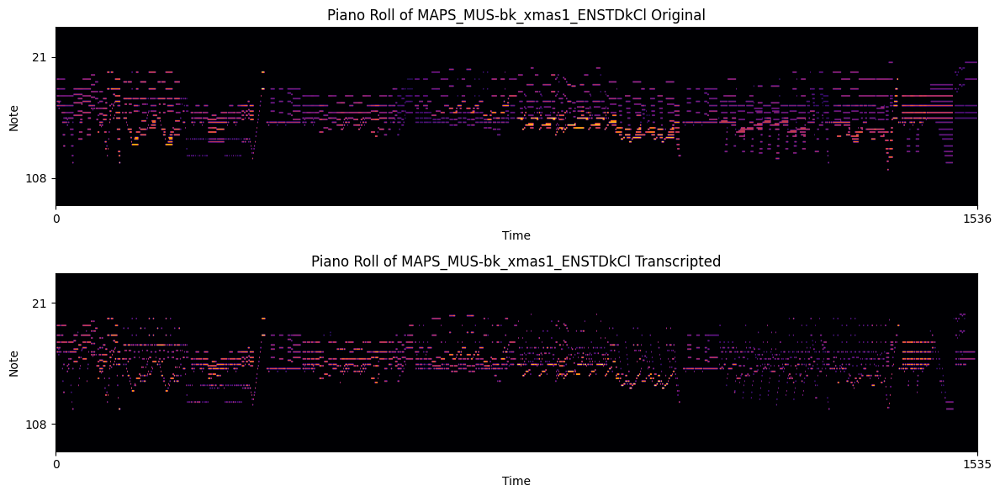

# tones2notes

Automatic Music Transcription (AMT) refers to the task of transcribing a given audio into symbolic representations (musical notes or MIDI). In this project, the goal is to transcribe musical recordings into music note events with pitch, onset, offset, and velocity. It is a challenging task due to the high polyphony of music pieces and requires appropriate data processing for audio files. We have implemented and evaluated Deep Learning models for music transcription. The architectural design of models and data processing techniques are based on [this](https://arxiv.org/pdf/2010.01815.pdf) paper. 


## Running Instructions
- The dataset used is MAPS, which can be downloaded from [here](https://amubox.univ-amu.fr/index.php/s/iNG0xc5Td1Nv4rR). After downloading it, store it in `data/MAPS`
- Install the required python packages by 
    ```
    pip install -r requirements.txt 
    ```
- Loading the dataset, splitting it and storing in .h5 binaries -
    ```
    python3 features.py --dir data/MAPS --workspace $(pwd)
    ```
- Training the model (includes both processing features and training)
    ```
    python3 src/main.py train --model_type='CRNN_Conditioning' --loss_type='regress_onset_offset_frame_velocity_bce' --batch_size=8 --max_note_shift=0 --learning_rate=5e-4 --reduce_iteration=10000 --resume_iteration=0 --early_stop=50000 --workspace=$(pwd) --cuda
    ```
    We have implemented 3 models, choose the `model_type` among ['CRNN', 'CCNN', 'CRNN_Conditioning']. Also, there are 2 loss functions available (regressed and non-regressed). Refer to the comments in `run.sh` for more info. The trained model will be stored at checkpoints in `checkpoints` folder with training stats in `statistics` folder
- Infering the output probabilities on Test dataset and storing them in `probs` folder
    ```
    python3 src/results.py infer_prob --model_type='CRNN_Condidioning' --checkpoint_path=$CHECKPOINT_PATH --dataset='maps' --split='test' --post_processor_type='regression'  --workspace=$WORKSPACE --cuda 
    ```
- Evaluating the Test dataset 
    ```
    python3 src/results.py calculate_metrics --model_type='CRNN_Condidioning' --dataset='maps' --split='test' --post_processor_type='regression' --workspace=$WORKSPACE 
    ```
Also, there are some result plots present in `notebooks/plots.ipynb` and piano roll with MIDI notes of a transcripted audio present in `transcription_plots.ipynb`
## For transcribing a given audio
```
python3 src/transcribe_and_play.py --audio_file <name of audio file>
```
It will transcribe the given audio using the best checkpoint model into MIDI, generate the MIDI file and also generate a video using [synthviz](https://pypi.org/project/synthviz/) library corresponding to the MIDI, displaying the notes played. Note that transcription requires `ffmpeg` backend and therefore does not work on gpu1.cse.iitb.ac.in, unless you install it with sudo permissions


## Transcription Results

- Piano Roll Comparison for an audio from MAPS Test dataset
    
- L theme from Death Note. The Original music is [this](https://www.youtube.com/watch?v=qR6dzwQahOM)

    https://github.com/Atishay25/tones2notes/assets/96432271/b5e7aff0-c105-4a3c-9cbd-6c6b0d84c3a7
- A musical piece from Aajkal tere mere pyar ke charche in Accordion. The original audio is [this](https://iitbacin-my.sharepoint.com/:u:/g/personal/210050026_iitb_ac_in/EYGvs6tPXKVMosWJ437BEuABmMQxtsDqO5geySFfj6IiIQ?nav=eyJyZWZlcnJhbEluZm8iOnsicmVmZXJyYWxBcHAiOiJPbmVEcml2ZUZvckJ1c2luZXNzIiwicmVmZXJyYWxBcHBQbGF0Zm9ybSI6IldlYiIsInJlZmVycmFsTW9kZSI6InZpZXciLCJyZWZlcnJhbFZpZXciOiJNeUZpbGVzTGlua0RpcmVjdCJ9fQ&e=uciCdn)

    https://github.com/Atishay25/tones2notes/assets/96432271/8195f423-b3b0-47f2-aafe-7de3f990cc50


### References

- Qiuqiang Kong, Bochen Li, Xuchen Song, Yuan Wan, and Yuxuan Wang. ”High-resolution Piano Transcription with Pedals by Regressing Onsets and Offsets Times.” arXiv preprint arXiv:2010.01815 (2020).
- [bytedance](https://github.com/bytedance/piano_transcription) and [kong's](https://github.com/qiuqiangkong/music_transcription_MAPS) repositories for data processing technique's and model architecture
- Valentin Emiya, Nancy Bertin, Bertrand David, Roland Badeau. MAPS - A piano database for multipitch estimation and automatic transcription of music
- [This](https://github.com/BShakhovsky/PolyphonicPianoTranscription) repository for information about datasets and understanding transcription pipeline
